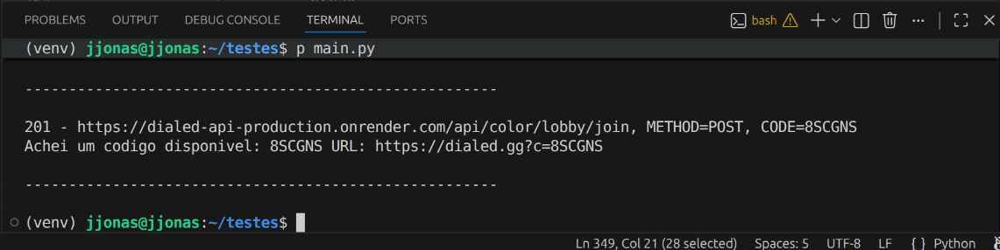

# Dialed Stress Test ⚫
Projeto focado em testar a API do Dialed.

## Principal
Ferramenta desenvolvida para testar e validar rotas da API REST (GET e POST) da plataforma [dialed.gg](https://dialed.gg/). Permite verificar o status de endpoints utilizados em 6 modos de jogo diferentes e testar a existência de lobbies.

## Features ✨
* **Gamemodes** - Teste os diferentes tipos de gamemodes que o Dialed oferece.
* **Multiplayer** - Em um dos modos, você poderá testar se um lobby existe ou não.
* **Modo de adivinhação** - Escolha entre aleatório e casas sequenciais.
* **Do seu jeito!** - Você pode personalizar praticamente tudo! Escolha a quantidade que seu computador aguenta.

## Guide 📚
### Pré-requisitos
* [Python 3.x](https://www.python.org/downloads) instalado.

### Passo a passo
1. Baixe a [Release](https://github.com/jjonasxd/dialed-stress-test/releases/tag/1.0.0)
2. Extraia o .zip
3. Crie um ambiente virtual e instale as dependencias:
```bash
python3 -m venv venv

# Windows
.\venv\Scripts\Activate.ps1

# Linux/Mac
source venv/bin/activate

pip install httpx
```
## Atenção ⚠️ Dialed 🔗

Este projeto não tem nenhuma afiliação com o [dialed.gg](https://dialed.gg); serve apenas como plataforma de teste legal. Não incentivamos o uso indevido do projeto.

## Rota achada

